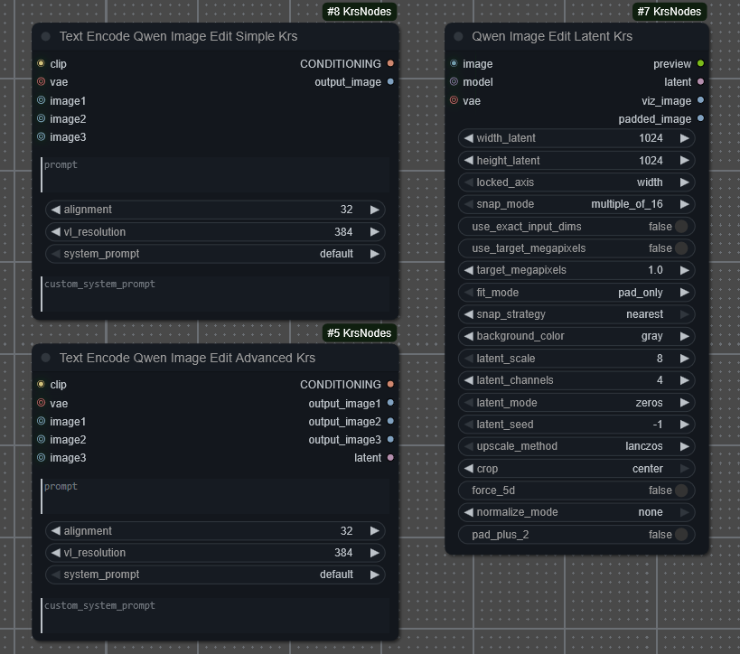

# **Comfyui Krs Nodes**

This repository contains a collection of custom nodes for ComfyUI. These nodes enhance the functionality of ComfyUI and provide additional features for users.
## **Installation**
To install the Krs nodes for ComfyUI, follow these steps:
1. Clone or download this repository.
2. Copy the contents of the repository into the `custom_nodes` directory of your ComfyUI installation.
3. Restart ComfyUI to load the new nodes.
## **Available Nodes**
- **TextEncodeQwenImageEditKrsSimple**: The idea behind this node is to provide a simple fix for well known Qwen Image Edit Shift "offset" Issue, as additionally to be able to adjust vl resolution for better clarity.

- **TextEncodeQwenImageEditKrsAdvanced**: Same as TextEncodeQwenImageEditKrsSimple with additional outputs for extra images and latent for more advanced workflows.

- **QwenImageEditLatentKrs**: Latent creation with extra controls for Qwen Image Edit to feed samplers. Still experimental.

## **Usage**
Simple as it gets, just replace your existing TextEncodeQwenImageEdit nodes with these custom nodes. Adjust the vl resolution as needed for your specific use case.

Just make sure to connect the input image directly to the TextEncodeQwenImageEditKrsSimple (or Advanced) node to avoid the offset issue.

Use node output_image (or latent for advanced node) for further processing in your workflow.

Defaults are set to match the original Qwen Image Edit behavior "Aligment= 32, Vl= 384". 1024 vl resolution is recommended for better clarity and identity following.

## ****Limitations:**** 

Higher vl resolution expected to give better clarity and identity following, however higher vl resolutions can lead to lower prompt coherence or ignorance of certain prompt elements.

In such cases two different approach can be followed;
1. Simple way; Try adjusting the vl resolution downwards or experiment with different resolutions to find the optimal balance between clarity and prompt adherence.

2. Advanced way; 

Input Image -> TextEncodeQwenImageEditKrsAdvanced with vl_resolution set to default "384" -> Ksampler -> TextEncodeQwenImageEditKrsAdvanced "with vl_resolution set to 1024" latent output -> And Then your main -> Ksampler

-Keep the same prompt for both TextEncodeQwenImageEditKrsAdvanced nodes. Also same seed for both Ksampler nodes.
-This way you can have both better clarity and prompt adherence, however it will require more VRAM and processing power.

These nodes are designed to work specifically with Qwen Image Edit models and may not be compatible with other models or workflows.

## **Contributing**
If you would like to contribute to this repository, please feel free to submit a pull request or open an issue for any bugs or feature requests.
